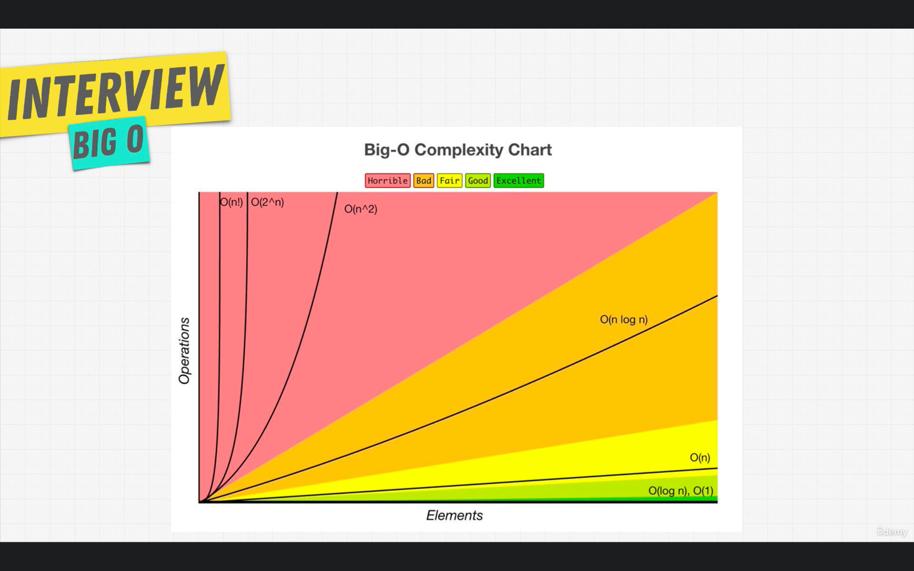

## Complexity Notes

## Algorithms and Complexity CheatSheet *(VVImp)*
https://www.bigocheatsheet.com/

### Various Complexity
````
What is the mileage that your car gives?

So let's discuss different scenarios.

Let's say the car gives an average of 12 km/hr in Traffic, an average of 20 km/hr on Highway and an average of 16 km/hr in Normal City Traffic.
Traffic is your worst case, Highway is your best case and Normal City Traffic is your average case.
This is similar to the notations that we use for Algorithm runtime Analysis.
Omega Notation ( Ω ) gives the best case complexity (highway in above case), Big O Notation ( O ) gives the worst case complexity (traffic in above case) and Theta Notation ( θ ) gives the average case complexity of an algorithm (normal city traffic in above case).
Storytelling and real life examples make you understand concepts clearly.

````

BigO Chart:


### Complexity O(n)
Finding Nemo problem:


Complexity Analysis


### Complexity O(1)


Complexity Analysis:


### Complexity Simplification Rules
1. Rule 1: Worst Case
2. Rule 2: Remove Constant
3. Rule 3: Different terms for inputs
4. Rule 4: Drop non Dominants

#### Note:
*Right Data Structure + Right Algo = Right Program*

